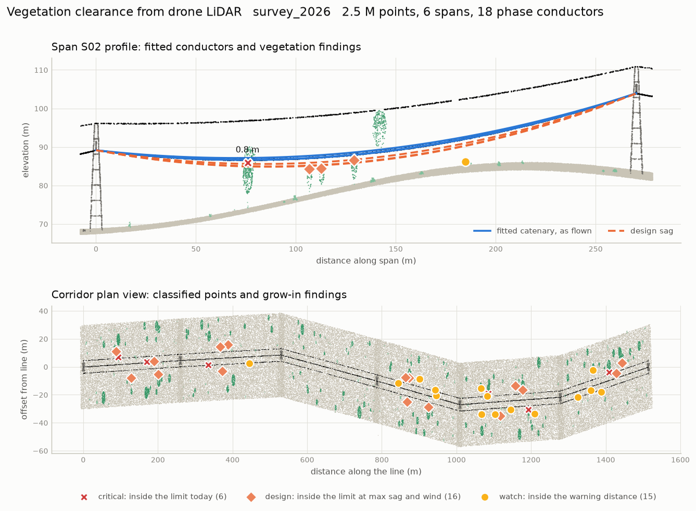
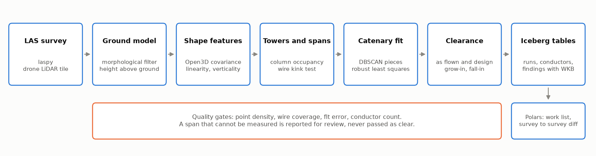
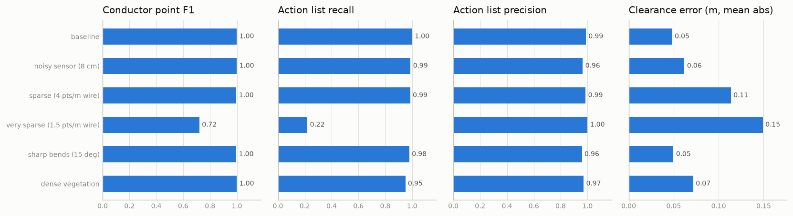

# lidar-line-clearance


Finds trees that are too close to a power line in a drone LiDAR survey, measures how close,
and stores the result as an auditable record in Apache Iceberg.



## The problem

Vegetation touching a conductor is one of the main ways a transmission line starts a
wildfire or trips. Utilities fly their corridors with LiDAR and then someone has to turn
millions of points into a short list: which trees, on which span, how many metres from which
wire. Three things make that harder than a distance query:

- The wire is not where it will be. On a hot, loaded day it sags lower, and wind pushes it
  sideways. A tree that is fine in the survey can be inside the limit at design condition.
- A tree that is far from the wire can still hit it if it falls.
- A survey with poor coverage of the wires produces no findings, which looks exactly like a
  clear corridor.

This project covers the whole path: classify the cloud, model each conductor as a catenary,
measure clearance as flown and at design condition, flag fall-in risk, refuse to report on
spans it could not model, and land everything in versioned tables that can be compared
between flights.

## Why now

- **LiDAR drones are moving into wildfire work.** On 1 October 2026 Ouster announced that
  Seneca will fly its Rev8 lidar on autonomous wildfire response drones, including for
  terrain mapping and infrastructure inspection
  ([Ouster, 1 Oct 2026](https://stocktitan.net/news/OUST/ouster-partners-with-seneca-to-advance-autonomous-drone-technology-xoi8puw2ivez.html)).
- **Vegetation management is becoming continuous and auditable.** T&D World describes
  utilities replacing fixed trimming cycles with risk based programs fed by LiDAR and drone
  data, and calls the documentation a chain of custody problem
  ([T&D World, 28 Jul 2026](https://www.tdworld.com/wildfire/article/55393955/the-new-wildfire-reality-reshaping-utility-vegetation-management)).
- **Geospatial data became a first class citizen of the lakehouse.** Apache Iceberg 1.12.0
  shipped at the end of September 2026 with geometry and geography mapped to Parquet logical
  types
  ([release notes summary, 30 Sep 2026](https://dremio.com/blog/apache-iceberg-1-12-0-whats-new-breaking-changes-and-upgrade-guide)),
  and PyIceberg 0.12.0 added the types on 3 September 2026
  ([PyIceberg 0.12.0](https://iceberg.apache.org/blog/apache-iceberg-python-0.12.0-release/)).
  I tried to use them here and hit the current limit: PyIceberg can read a geometry column
  but cannot write a v3 table yet. [ADR 0003](docs/adr-0003-iceberg-geometry.md) has the
  details and what the project does instead.

## How it works



| Stage | What happens | Tooling |
|---|---|---|
| Read | LAS or LAZ into an array, input hashed for lineage | laspy |
| Ground | Lowest return per 1 m cell, progressive morphological opening, median refinement, height above ground for every point | NumPy, SciPy ndimage |
| Noise | Returns with almost no neighbours are dropped, once globally and once among vegetation | Open3D |
| Wire candidates | Points above 5 m whose neighbourhood is a horizontal line (covariance eigenvalues) | Open3D |
| Towers | Tall filled columns that wires run through and kink upwards at, ordered into spans | NumPy, SciPy |
| Conductors | Candidates split into connected pieces, pieces merged when one catenary explains them, robust fit per wire, shield wire identified by height | Open3D DBSCAN, SciPy least squares |
| Clearance | Distance from every vegetation return to each phase, as flown and against the design envelope (more sag plus wind swing), grouped per tree. Fall-in test per tree top | SciPy cKDTree |
| Quality gates | Point density, wire coverage, fit error, conductor count per span | |
| Store | `runs`, `conductors`, `findings` partitioned by survey, geometry as WKB, atomic replace per survey | PyIceberg, Shapely |
| Use | Work list, snapshot history, survey to survey diff | Polars |

Severity of a grow-in finding:

| Severity | Meaning |
|---|---|
| `critical` | inside the minimum clearance in the survey itself |
| `design` | clear today, inside the minimum once the wire is at design sag and blown out |
| `watch` | inside the warning distance under either condition |

`fall_in` findings are trees taller than their distance to the nearest phase.
`coverage_gap` findings are spans the pipeline refused to measure.

## Quick start

Needs Python 3.10 to 3.13. Tested on 3.12 and 3.13.

```bash
python -m venv .venv && source .venv/bin/activate
pip install -e ".[dev]"

# two surveys of the same 1.5 km corridor, one year apart
lineclear demo --workdir demo -c configs/default.yaml

lineclear findings survey_2026 --warehouse demo/warehouse   # work list, worst first
lineclear compare survey_2025 survey_2026 --warehouse demo/warehouse
lineclear history findings --warehouse demo/warehouse       # Iceberg snapshots
```

On your own data:

```bash
lineclear run my_corridor.las -c configs/default.yaml --classified-out classified.las --figure overview.png
```

Coordinates must be in a projected CRS in metres. `pip install ".[laz]"` adds LAZ support.
No account, API key or service is needed. `.env.example` lists the single optional variable.

## Results

Everything below was measured in this repository with `lineclear benchmark --seeds 5` and
`lineclear demo`, on synthetic surveys with analytic ground truth, on one CPU core. The
generator and its limits are described further down. Raw numbers are in
[docs/benchmark.json](docs/benchmark.json).

| Condition | Surveys flagged for review | Conductor point F1 | Conductors modelled | Action list precision | Action list recall | Critical recall | Clearance error, mean (m) | Points per second |
|---|---|---|---|---|---|---|---|---|
| baseline | 0 of 5 | 0.999 | 120 of 120 | 0.99 | 1.00 | 1.00 | 0.05 | 119k |
| noisy sensor (8 cm) | 0 of 5 | 0.999 | 120 of 120 | 0.96 | 0.99 | 1.00 | 0.06 | 128k |
| sparse (4 pts/m wire) | 0 of 5 | 0.996 | 120 of 120 | 0.99 | 0.99 | 1.00 | 0.11 | 145k |
| very sparse (1.5 pts/m wire) | 5 of 5 | 0.720 | 74 of 120 | 1.00 | 0.22 | 0.29 | 0.15 | 83k |
| sharp bends (15 deg) | 1 of 5 | 0.995 | 120 of 120 | 0.96 | 0.98 | 0.97 | 0.05 | 128k |
| dense vegetation | 0 of 5 | 0.999 | 120 of 120 | 0.97 | 0.95 | 0.99 | 0.07 | 68k |

Five surveys per condition, six spans and about 1.5 km each, 60 M points in total. In every
condition all 35 towers were found with no false ones, within 9 cm on average, and the mean
sag error of the fitted conductors stayed under 2 cm.



How to read it:

- **Action list** is what a vegetation crew would receive: every tree whose true clearance
  at design condition is under 3 m. Truth is the distance from the analytic crown to the
  true catenary. A prediction counts when a `critical` or `design` finding lands on that tree.
- **Critical** is the same for trees inside 3 m as flown.
- **Clearance error** is the absolute difference between measured and true distance.
- Precision below 1 in the clean cases is mostly deliberate. Severity is decided with a
  10 cm margin against the limit, because LiDAR rarely hits the outermost leaves and the
  measured clearance errs on the high side. Without the margin an earlier run missed trees
  at 2.92 m and 3.00 m that it measured as 3.01 m and 3.08 m.
- **Very sparse** is the honest row. With 1.5 returns per metre of wire the pipeline models
  74 of 120 conductors and recall collapses, but every one of those surveys
  comes back as `needs_review` with a `coverage_gap` finding on each span it skipped, and
  precision stays at 1.0. It does not invent findings and it does not call the corridor clear.

Demo corridor (`configs/default.yaml`, seed 7):

| | survey_2025 | survey_2026 (trees 0.6 m taller, 10% trimmed) |
|---|---|---|
| Points | 2,540,653 | 2,525,313 |
| Towers found | 7 of 7 | 7 of 7 |
| Conductors modelled | 24 of 24 | 24 of 24 |
| Mean sag error | 0.008 m | 0.008 m |
| Findings: critical / design / watch / fall-in | 7 / 15 / 15 / 15 | 6 / 16 / 15 / 16 |
| Action list precision / recall | 1.00 / 1.00 | 0.95 / 1.00 |
| Clearance error, mean | 0.06 m | 0.05 m |
| End to end, read to Iceberg commit | 22.6 s | 20.9 s |

`lineclear compare survey_2025 survey_2026` reports 7 new, 7 resolved and 30 persisting
grow-in findings, with a median clearance change of -0.27 m on the persisting ones.

## What goes into the lakehouse

```
grid.runs        one row per survey: input sha256, config hash, code version, counts, status
grid.conductors  one row per wire: catenary constant, sag as flown and at design, fit error,
                 coverage, LineStringZ in WKB
grid.findings    one row per finding: severity, clearance as flown and at design, tree
                 height, PointZ in WKB plus plain easting, northing, elevation
```

Rerunning a survey replaces its partition in one atomic commit, so results are idempotent
and every rerun stays visible in the snapshot log (PyIceberg records the replace as a delete
snapshot followed by an append snapshot). The run id is a hash of the input file, the
pipeline config and the code version.

## Design notes

- **Fail closed.** If a span has the wrong number of conductors or a wire with low coverage
  or a poor fit, the span is not measured. An earlier version measured it anyway: one missed
  tower merged two spans, the fit was wrong, and wire points left without a model were read
  as vegetation 2 cm from a conductor. That produced 13 false critical findings in one
  survey. Now the span becomes a `coverage_gap` and the run is marked `needs_review`.
- **Wire like points without a model are never vegetation.** They stay unclassified.
- **Distances use raw returns.** Voxel averaging pulls the crown surface inwards and
  overstates clearance.
- **Towers are confirmed by the wires.** A tall tree next to the line fills a column just
  like a tower. What separates them is that wires hang convex inside a span and only kink
  upwards where they are held, so the wire elevation at a real support is above the chord
  between the points 25 m to each side. The test uses elevation on both sides, which makes
  it independent of terrain slope.
- **Pieces of a wire are merged with a joint fit.** Testing a piece against a catenary
  fitted to another short piece fails, because short fits extrapolate badly. Fitting both
  together and checking the residual does not.
- **The terrain model is de-biased.** The lowest return per cell sits about two sigma under
  the real surface. With an 8 cm sensor that pushed ground points into the vegetation class
  (vegetation F1 0.53 in the first benchmark). A median over a thin band above the first
  surface brought it back to 0.97.

The three ADRs in [docs](docs) explain the tool choices:
[geometry instead of deep learning](docs/adr-0001-geometry-over-deep-learning.md),
[Open3D, laspy and SciPy](docs/adr-0002-open3d-laspy-scipy.md),
[Iceberg and WKB geometry](docs/adr-0003-iceberg-geometry.md).

## Repository layout

```
src/line_clearance/
  config.py       typed settings, config fingerprint
  simulate.py     synthetic corridor with ground truth
  io.py           LAS read and write, input hashing
  ground.py       terrain model and height above ground
  features.py     Open3D wrappers: covariance features, outliers, DBSCAN
  towers.py       tower detection and span frames
  catenary.py     catenary maths, design sag and blowout
  conductors.py   piece merging and per wire fit
  clearance.py    grow-in, fall-in, tree tops
  pipeline.py     orchestration, quality gates, persistence
  lakehouse.py    Iceberg schemas, idempotent writes, history
  compare.py      survey to survey diff
  evaluate.py     scoring against ground truth
  benchmark.py    conditions sweep
  report.py       figures
  cli.py          command line
configs/          default and smoke scenarios
tests/            pytest suite
docs/             ADRs, figures, benchmark output
```

## CLI

| Command | Purpose |
|---|---|
| `lineclear simulate out.las` | synthetic survey plus truth files |
| `lineclear run survey.las` | analyse and write to Iceberg |
| `lineclear evaluate survey.las` | score a simulated survey against its truth |
| `lineclear findings SURVEY_ID` | work list from the lakehouse |
| `lineclear compare BASE HEAD` | new, resolved and persisting findings between two surveys |
| `lineclear history TABLE` | snapshot log |
| `lineclear benchmark` | accuracy and speed across conditions |
| `lineclear demo` | two surveys end to end |

Tests and lint: `pytest` and `ruff check src tests`. CI runs both plus the smoke demo.

## Limitations

- **Validated on synthetic data only.** The generator has rolling terrain, lattice towers,
  three phases and a shield wire, ellipsoid trees, sensor noise, stray returns and gaps in
  the wire returns. It has no buildings, road crossings, second circuits or bundled
  conductors, and trees are simpler than real ones. Expect to retune on a real survey.
- **Clearance thresholds are placeholders.** 3 m and 5 m, a sag factor of 1.25 and a 20
  degree blowout are engineering defaults for the demo, not values from any standard. A
  real deployment takes them from the voltage class and the conductor thermal rating.
- **Design sag is a geometric scaling**, not a conductor temperature model.
- **Single circuit, one row of towers.** Towers are ordered along the main direction of the
  line, so loops and branches are not handled.
- **In memory, single process.** About 2.5 M points take 21 s on one core. A long corridor needs
  tiling by span, which the stage boundaries already allow.
- **Vegetation within 7 m of a tower centre is absorbed by the tower mask.**
- **Needs about 4 returns per metre of wire.** Below that it reports gaps instead of findings.
- **Iceberg v2 with WKB**, not native v3 geometry, for the reason in ADR 0003. The catalog
  stores absolute paths, so a warehouse folder cannot be moved between machines.

## Roadmap

- Validate on public data (USGS 3DEP tiles with transmission lines) and publish the deltas.
- Per span tiling with a streaming reader for corridors of tens of kilometres.
- Thermal sag from conductor type and temperature.
- Native Iceberg geometry once PyIceberg can write format version 3.

## License

MIT, see [LICENSE](LICENSE).
